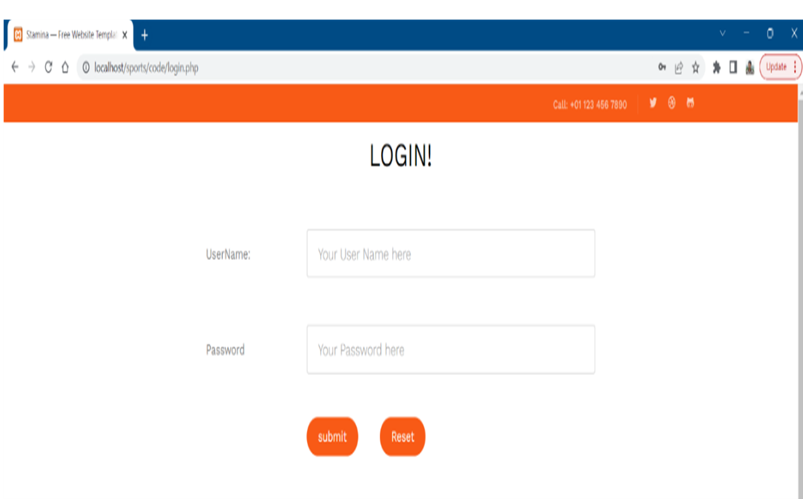
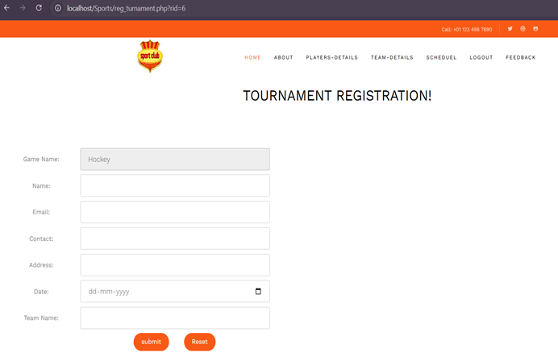
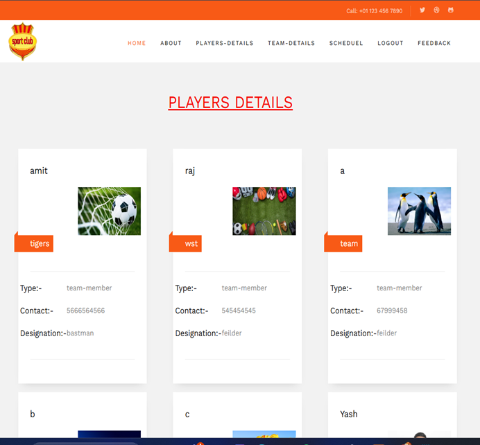
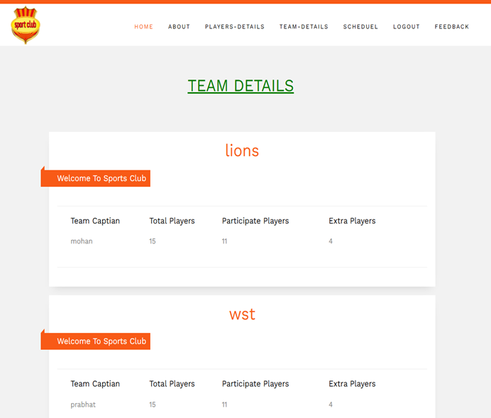
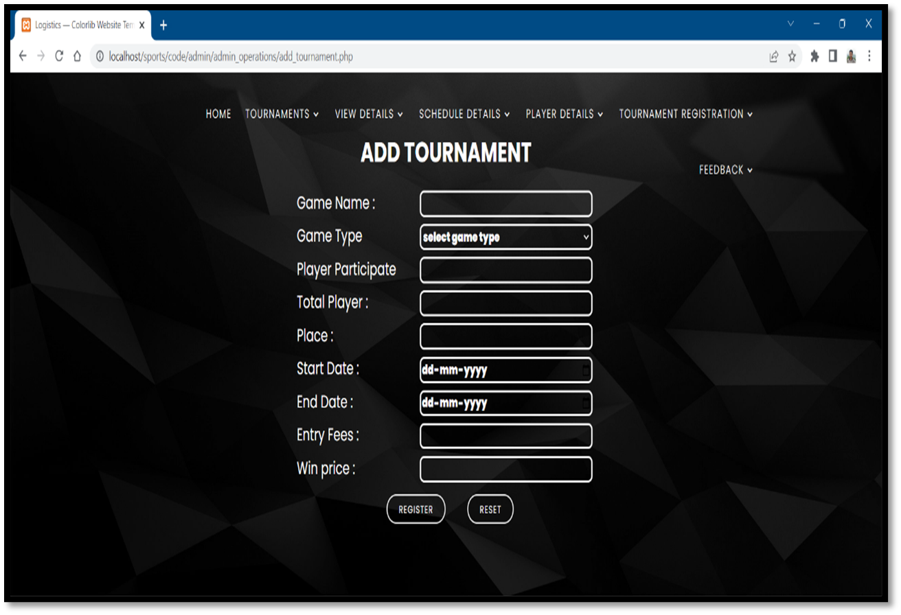
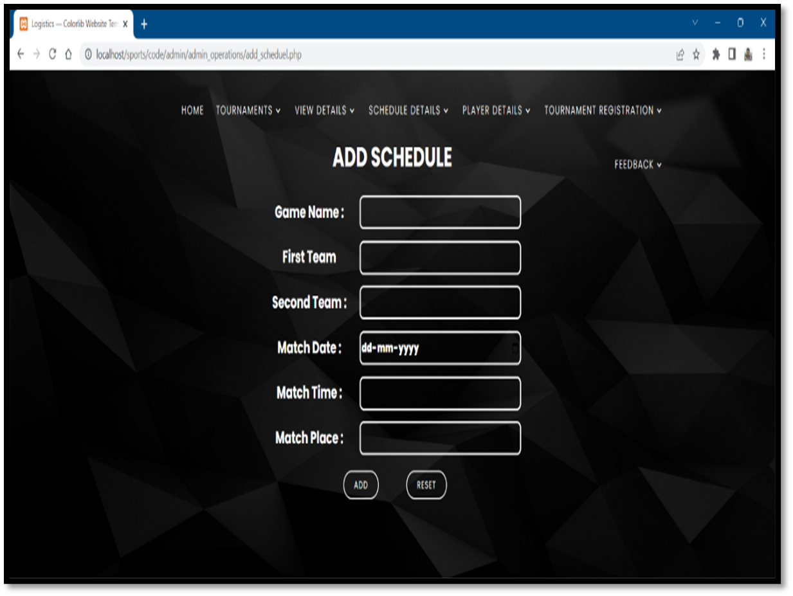
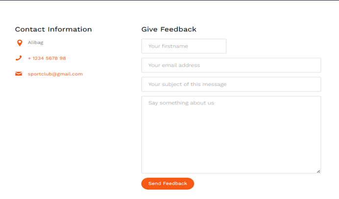

# Sports Club Management System

## Project Overview
The Sports Club Management System is a web-based application developed to manage sports club activities efficiently. The system helps manage player registrations, tournaments, schedules, team details, and club operations through an interactive web interface.

---

## Features
- Player Registration System
- Team Management
- Tournament Management
- Match Scheduling
- Player Details Management
- Feedback System
- Admin Panel
- Login & Authentication System

---

## Technologies Used
- PHP
- MySQL
- HTML
- CSS
- Bootstrap
- JavaScript
- XAMPP

---

## Project Structure
- Admin Module
- Player Registration Module
- Tournament Management Module
- Schedule Management Module
- Team Details Module
- Feedback Management Module

---

## Database
Database file is available inside the `database` folder.

```bash
database/sportclub.sql
```

---

## Screenshots

### Home Page


### Login Page


### Team Registration Page


### Players Details Page


### Team Details Page


### Add Tournament Page


### Add Schedule Page


### Feedback Page


---

## How to Run the Project

1. Install XAMPP
2. Move project folder to:
```bash
htdocs
```

3. Start:
- Apache
- MySQL

4. Import database:
```bash
sportclub.sql
```

5. Open browser and run:
```bash
http://localhost/Sports-Club-Management-System
```

---

## Conclusion
This project provides an efficient solution for managing sports club activities including player management, tournament scheduling, and administrative operations through a centralized web application.

---

## Author
**Shubham Bhagat**  
Aspiring Data Analyst & Web Developer
